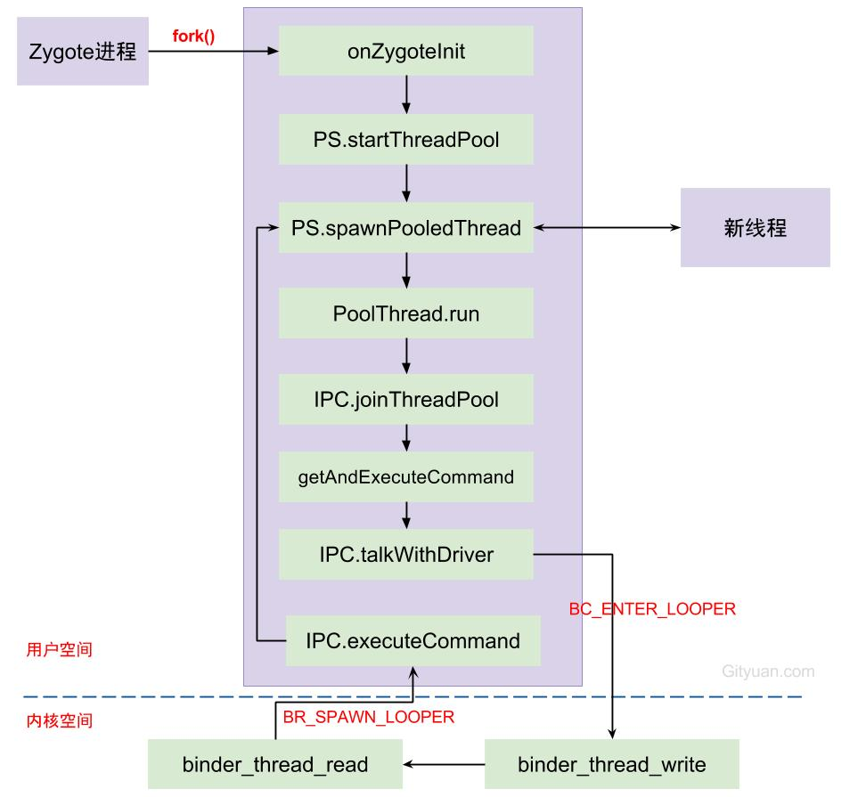

### Binder线程池的工作过程是什么样?

假如进程 S 是 Server 端，提供 Binder 实体，线程 T1 从 Client 进程 C 中通过 Binder 的引用向进程 S 发送请求。S 为了处理这个请求需要启动线程 T2，
而此时线程 T1 处于接收返回数据的等待状态。T2 处理完请求就会将处理结果返回给 T1，T1 被唤醒得到处理结果．这个是 Binder 通信的基本过程．

对于 Server 进程 S 来说，可能会有许多 Client 同时向其发起请求，为了提高效率往往开辟线程池并发处理收到的请求．

- BINDER_SET_MAX_THREADS
- BC_REGISTER_LOOP
- BC_ENTER_LOOP
- BC_EXIT_LOOP
- BR_SPAWN_LOOPER : 线程池中是不是已经没有闲置线程了 ．如果是，并且线程总数还没有达到线程池设定的最大线程数，
就会在当前读出的数据包后面再追加一条 BR_SPAWN_LOOPER 命令，告诉 Server 端，线程即将不够用了，请再启动一个新线程

### Binder线程创建
[-> app_main.cpp]
~~~java
virtual void onZygoteInit() {
    //获取ProcessState对象
    sp<ProcessState> proc = ProcessState::self();
    //启动新binder线程 
    proc->startThreadPool();
}
~~~

Binder设计架构中，只有第一个Binder主线程(也就是Binder_1线程)是由应用程序主动创建，Binder线程池的普通线程都是由Binder驱动根据IPC通信需求创建，

每次由Zygote fork出新进程的过程中，伴随着创建binder线程池，调用spawnPooledThread来创建binder主线程。当线程执行binder_thread_read的过程中，
发现当前没有空闲线程，没有请求创建线程，且没有达到上限，则创建新的binder线程。

### Binder线程的分类
- Binder主线程：在进程的 main 函数中通过调用 startThreadPool() 函数创建的线程,并且主线程是不会退出的
- Binder普通线程：是由 Binder 驱动通过发送 BR_SPAWN_LOOPER 命令，然后应用进程调用 spawnPooledThread 函数创建的线程
- Binder其它线程：是调用 IPC.joinThreadPool()，将当前线程直接加入 Binder 线程队列的线程，例如 media 的主线程
