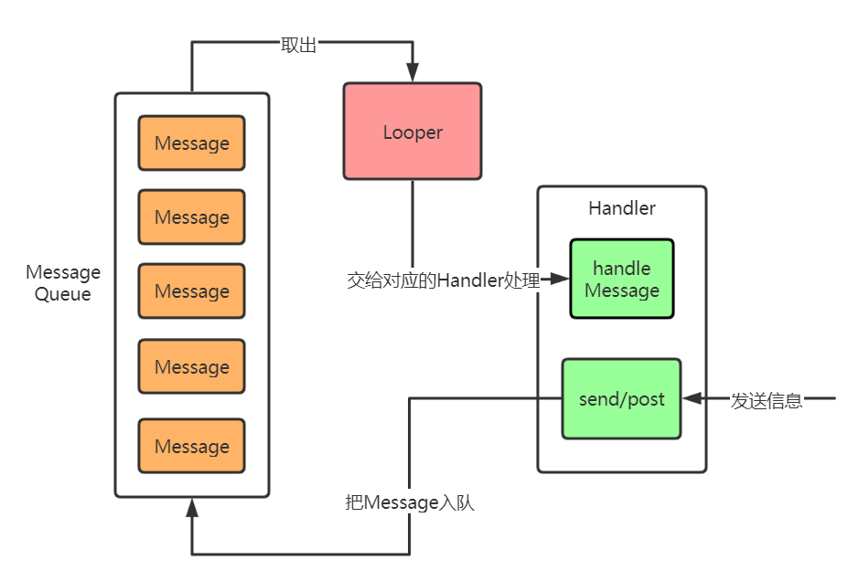

### Handler怎么进行线程通信，原理是什么?

- Looper存储在ThreadLocal中，Looper在创建时会同时创建MessageQueue，作为其成员对象.
因此Looper和MessageQueue是属于创建者线程的，各线程之间的Looper和MessageQueue相互独立。
- Handler在创建时会从当前线程的ThreadLocal中取得Looper.
- 发送消息时，在发送线程中调用接收线程中的Handler的sendMessage方法，过程中，Handler会将自身赋予到Message的target中，并将Message插入到Handler对应的MessageQueue中。
- 而接收线程中的Looper在循环过程中会取出这个Message，通过Message.target取出接收线程中的Handler，并将消息交Handler对象处理。由此实现了跨线程通信。
- 要注意的是：线程与Looper和MessageQueue是一对一的关系，即一个线程只维护一个Looper和一个MessageQueue;而线程与Handler的关系是一对多，即一个线程可以有很多Handler，一个Handler只对应一个线程，这也是为什么Handler在发送消息时，为什么要将自身赋给Message.target的原因。

