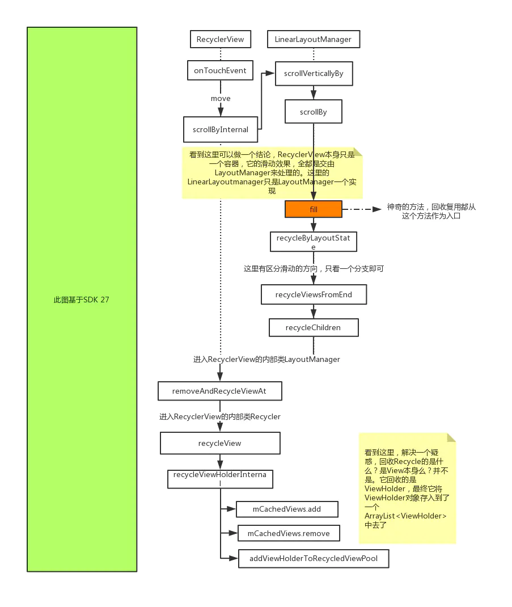

### RecyclerView的回收复用机制

RecyclerView 滑动场景下的回收复用涉及到的结构体两个：mCachedViews 和 RecyclerViewPool。

mCachedViews 优先级高于 RecyclerViewPool，回收时，最新的 ViewHolder 都是往 mCachedViews 里放，如果它满了，那就移出一个扔到 ViewPool 里好空出位置来缓存最新的 ViewHolder。

复用时，也是先到 mCachedViews 里找 ViewHolder，但需要各种匹配条件，概括一下就是只有原来位置的卡位可以复用存在 mCachedViews 里的 ViewHolder，如果 mCachedViews 里没有，那么才去 ViewPool 里找。

在 ViewPool 里的 ViewHolder 都是跟全新的 ViewHolder 一样，只要 type 一样，有找到，就可以拿出来复用，重新绑定下数据即可。

回收和复用的都是ViewHolder对象，在RecyclerView的内部类`Recycler`中，可以看到四重缓存中的关键数据结构都和ArrayList<ViewHolder>有关,ViewHolder是itemView的封装。

#### mChangedScrap
`该层缓存目的是为了当调用notifyItemChanged(pos),notifyItemRangeChanged(pos,count)后该位置信息发生改变的缓存`,一般用于change动画，
注意mChangedScrap并不是说存储改变的位置并直接复用，而是在预布局时存储改变的holder，
重新创建新holder并绑定数据来充当改变位置的数据刷新,然后根据新老holder执行change动画。动画执行完毕后新的holder会被缓存到mRecyclerPool中。
那如何复用notifyItemChanged(pos)改变的holder呢？答案在 mAttachedScrap vs mChangedScrap中

#### mAttachedScrap
该层缓存目的是在调用notfyXxx时未改变的item，以及影响RecyclerView重新绘制的情况。

mChangedScrap和mAttachedScrap可以看做是一个层级，都是屏幕上可见itemView,只不过区分了状态(改变和未改变)。

#### mViewCacheExtension
用户自定义缓存，感觉没什么用。

#### mCachedViews
作用在滑动，当滑进屏幕或滑出屏幕，为了避免多次bind，是一个大小为2的List。

#### mRecyclerPool
作用在滑动,当超过mCachedViews缓存的大小时会将mCachedViews最老的数据移除放入到mRecyclerPool中
根据itemType拿 holder集合，该集合默认大小为5，每次从mRecyclerPool取出的holder都要重置视图信息，也就是需要从新bind。
当mRecyclerPool 找不到缓存的holder时会调用adapter的onCreateViewHolder和onBindViewHolder

#### 预测动画

> 为什么要调用notifyXxx后要执行两次布局呢？一次预布局，一次实际布局？
因为RecyclerView 要执行预测动画。比如有A,B,C三个itemView，其中A和B被加载到屏幕上，这时候删除B后，按照最终效果我们会看到C移动到B的位置；
因为我们只知道 C 最终的位置，但是不知道 C 的起始位置在哪里(即C还未被加载)。      
第一次 预先布局      
将之前原状态 下的 item 都布局出来。并且根据 Adapter 的 notify 信息，我们知道哪些 item 即将变化了，所以可以加载出另外的 View。在上述例子中，
因为知道 B 已经被删除了，所以可以把屏幕之外的 C 也加载出来。     
第二次，实际布局，也就是变化完成之后的布局。      
这样只要比较前后布局的变化，就能得出应该执行什么动画了，就称为预测动画。

#### 滑动回收复用机制
将滑出屏幕的缓存在mCachedViews中，默认大小为2，如果mCachedViews满，则删除mCachedViews最先被缓存的holder,放入到mRecyclerPool中。
为什么要先放入到mCachedViews而不是直接放入mRecyclerPool，为什么要这样做？

因为刚滑出屏幕的itemView可能会被滑动进来，所以加了一层mCachedViews缓存，
而从mCachedViews中获取的holder是不需要重新bind数据的。mRecyclerPool取出的holder会被重置信息，重新bind数据的。

mChangedScrap，mAttachedScrap  针对的是屏幕可见itemView信息发生变化时的回收与复用     
mCachedViews，mRecyclerPool 针对的是滑动回收与复用        
另外可以通过setItemViewCacheSize 设置mCachedViews缓存大小，可以通过 recycledViewPool.setMaxRecycledViews() 修改mRecyclerPool缓存大小     

参考
- https://juejin.cn/post/6854573221702795277
