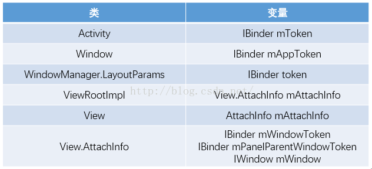

### WindowMangerService中token到底是什么

我们看到，这么多类中都定义了token这个东东，而且这个token竟然是一个IBinder对象，有的类中虽然定义token时没有直接指定为IBinder，
但是追根溯源，发现其实最终说的还是IBinder，比如View.AttachInfo这个类中。其实当小伙伴们看到IBinder之后，应该立马就想到了IPC，
这是套路。我们知道，`Android的framework框架在整个系统中扮演的角色相当于服务端，而我们开发的应用程序相当于客户端，`
Activity的创建、启动等操作都是通过IPC的方式来实现服务端和客户端之间的通信，所以说IPC在这里扮演了相当重要的角色。OK，说完了这些，我们来分别看看几个重要的token。

#### Activity中的token

要了解Activity中的token，我们得先明白Activity中的另外一个东西，叫做ActivityRecord，ActivityRecord是AmS中用来保存一个Activity信息的辅助类，
这个类中有许多属性，这些属性可以从整体上分为两大部分：Activity所处的环境信息和运行状态信息。
Activity所处的环境信息主要包括Activity所属的Package（对应变量为packageName）、所在进程名称（对应变量为processName）、图标（对应变量icon）、主题（对应变量theme）等；
运行状态信息主要有idle、stop、finishing等，这些状态信息与Activity生命周期相关。这里有一个地方需要小伙伴们注意，在ActivityRecord中有一个变量叫做appToken，
这个变量的类型是一个IApplicationToken.Stub，这里的Token提供了对ActivityRecord类的基本操作，看到这里，小伙伴们应该心里有数了，这个appToken也是一个Binder，
可以进行IPC调用，这里我们一般是在WmS中对该对象进行IPC调用。

OK，说完了ActivityRecord，我们再来看一看Activity中的mToken变量。这个变量的本质是一个Binder，通过查找源码，
我们发现，该变量的赋值是在Activity的attach方法中进行的，如下：
~~~java
final void attach(Context context, ActivityThread aThread,
            Instrumentation instr, IBinder token, int ident,
            Application application, Intent intent, ActivityInfo info,
            CharSequence title, Activity parent, String id,
            NonConfigurationInstances lastNonConfigurationInstances,
            Configuration config, String referrer, IVoiceInteractor voiceInteractor,
            Window window) {
		
		......
		......
		
        mToken = token;
		
		......
		......
    }
~~~

OK，研究过Activity启动过程的小伙伴应该都清楚attach的调用位置吧，就是ActivityThread这个类啦，在ActivityThread的scheduleLaunchActivity方法中，
我们拿到了参数token，这个token经过好几道程序，最终变为了上文的token。由于AmS为每一个创建的Activity都创建了一个ActivityRecord，
由于Binder可以用来标识多个进程间的同一个对象，所以这里的mToken变量还有一个作用就是指向了ActivityRecord。
在我们的窗口创建过程中，涉及到的IPC通信就是两方面：`一个是指向某个W类的token，另一个是指向ActivityRecord的token`，
指向W类的token主要是用来实现WmS和应用所在进程通信，指向ActivityRecord的token则是实现WmS和AmS通信的。Activity中的mToken很明显是第二种。

#### Window中的mAppToken

在我们的Android系统中，每一个Window对象都有一个mAppToken变量，但是小伙伴注意区分Window和窗口
（窗口本质上就是一个View，而Window是一个应用窗口的抽象，WmS把所有的用户消息发给View/ViewGroup，但是在View/ViewGroup处理消息的过程中，
有一些操作是公共的，Window把这些公共行为抽象出来，是为Window）。由于窗口本质是一个View，和Window没有关系，所以这里mAppToken并不是W类的引用，
那不是W类的引用，就只能是ActivityRecord的引用了，既然是ActivityRecord的引用，那么毫无疑问，mAppToken的主要功能就是实现WmS和AmS之间的通信。
但是在实际开发中，由于Window并不总是对应一个Activity，我们常见的Dialog，ContextMenu等等中也会包含一个Window，这个时候就不牵涉WmS和AmS之间的通信问题了，
那么这个时候Window中的mAppToken为空，否则mAppToken和Activity中的mToken是相同的。

#### WindowManager.LayoutParams中的token

WindowManager.LayoutParams中竟然会有一个token，很多小伙伴可能会觉得奇怪，其实仔细想想这也没什么，WindowManager类可以向WmS中添加一个窗口，窗口添加成功之后，
我们还要和这个窗口进行通信，通信就需要Binder，也就是这里所说的token了。但是由于我们往WmS中添加的窗口类型可能会有差异，所以token的含义也会有差别。
这里的差别主要体现在WindowManagerService的addWindow方法上，总结该方法，我们可以发现token的取值一共有三种情况：

1.如果我们创建的是一个应用窗口，比如Activity，那么这里的token的值和Window中的mAppToken的值相同，也就是和Activity的mToken的值相同，
都是指向ActivityRecord对象，但是在调用addView方法的时候，系统会对这里的token的值进行调整，使之变为一个指向W的对象，这样，WmS就可以通过这个token进行IPC调用，从而控制窗口的行为。

2.如果我们创建的窗口为子窗口，即Dialog、PopupWindow等，那么token就为其父窗口的W对象，如果查找不到父窗口，或者父窗口的类型还是子窗口，那么都会抛出异常。

3.如果创建的是系统窗口，那么分两种情况，对于TYPE _ INPUT _ METHOD，TYPE _ VOICE _ INTERACTION，TYPE _ WALLPAPER，TYPE _ DREAM，
TYPE _ ACCESSIBILITY _ OVERLAY这些系统窗口，token是不可以为null的，而对于其他的系统窗口，token可以为null

#### View中的token

View中并不直接存在一个token，但是View中有一个mAttachInfo，这个变量中token，所以在这里我们需要先分析一下这个mAttachInfo到底是个什么东西？
在View中和ViewRootImpl 中都有一个mAttachInfo，而一个应用中的每一个View都对应了一个ViewRootImpl对象，ViewRootImpl中有一个mAttachInfo对象，
这个对象是在ViewRootImpl被构造的时候创建的。ViewRootImpl中的mAttachInfo对象的数据类型就是View.AttachInfo，所以说这两个对象其实是同一种类型，
但是到底是不是同一个东西，这个还需要我们进一步考究。当一个View在屏幕上显示出来的时候，它必须经历一个过程就是View的绘制，了解过View绘制过程的小伙伴应该都明白，
View绘制有一个核心方法就是ViewRootImpl.performTraversals，在这个方法中，系统会去调用View/ViewGroup的dispatchAttachedToWindow方法，源码如下：

~~~java
host.dispatchAttachedToWindow(mAttachInfo, 0);
~~~

这个时候又回到了View方法，在View的dispatchAttachToWindow方法中，ViewRootImpl中的mAttachInfo竟然赋值给了View中的mAttachInfo了。也就是说，
View中的mAttachInfo和ViewRootImpl中的mAttachInfo其实是同一个东西，mAttachInfo中有三个Binder变量，这个我们来看其中两个：

**mWindowToken**，这个表示的是当前窗口所对应的W对象，因为View本身并不能直接从WmS中接收消息，要通过W类才能实现，故此mWindowToken指向了该窗口对应的W对象。

**mPanelParentWindowToken**，如果该窗口为子窗口，那么该变量就是父窗口中的W对象。

#### 总结
OK，以上就是我们WmS系统中几个常见的token，这些token基本都和Binder脱不了关系，Binder又是为了进行IPC调用，
WmS中的IPC调用大致又可以分为两类，所以总结起来就是这样：窗口的创建一般会涉及到两方面的IPC通信，一个是WmS和应用所在进程进行通信，
还有一个就是WmS和AmS进行通信。就是这两种，第一种对应的token指向一个ViewRootImpl.W对象，第二种对应的token指向一个ActivityRecord对象。

最后再说说开篇说的PopupWindow中的问题，很明显PopupWindow中的第一个参数是为了获取View中的mAttachInfo，
进而获取mAttachInfo中的指向W类的Binder对象，然后通过该对象就能获取用户的输入了。

参考：
- https://blog.csdn.net/u012702547/article/details/53179957
