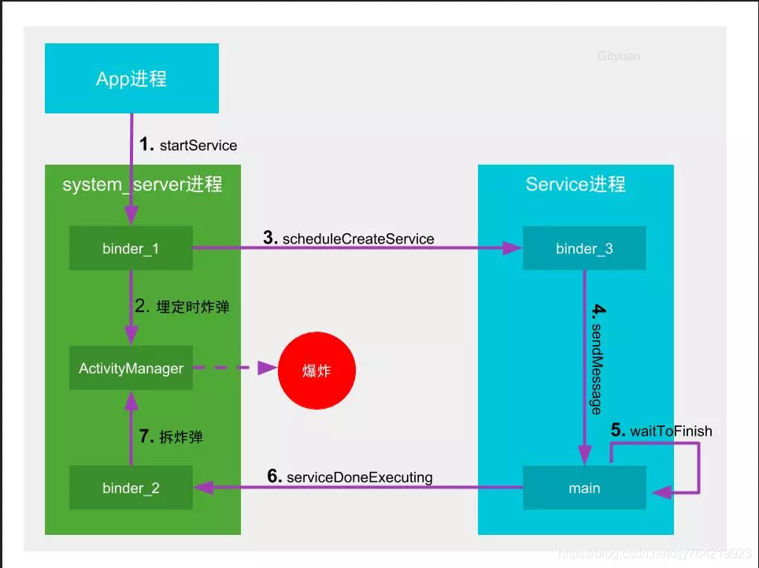
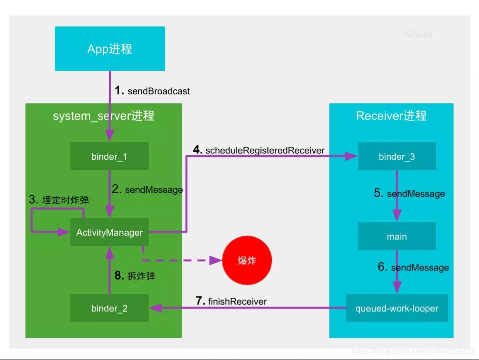
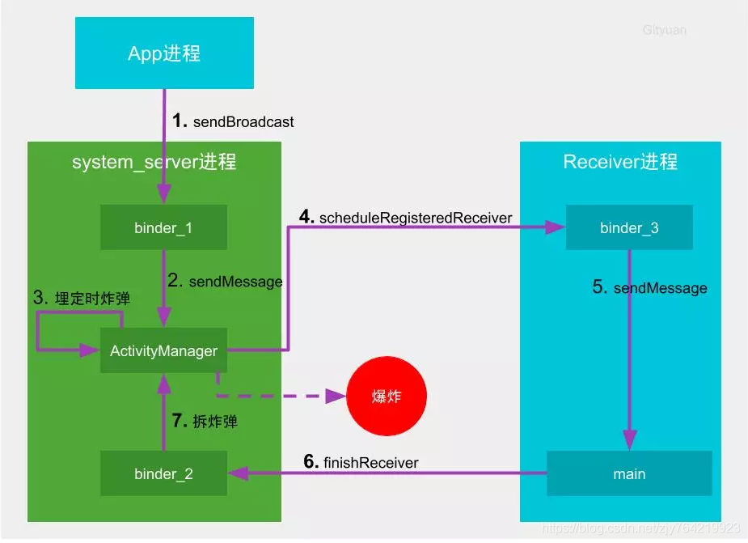
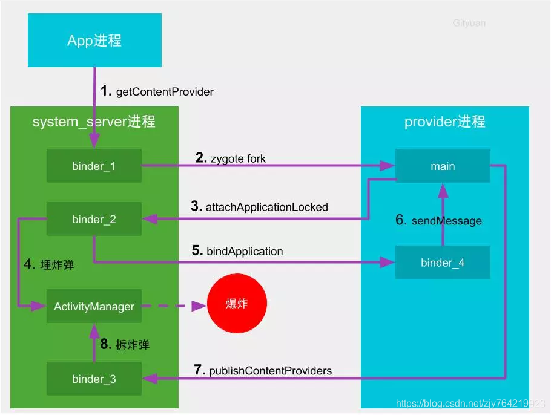
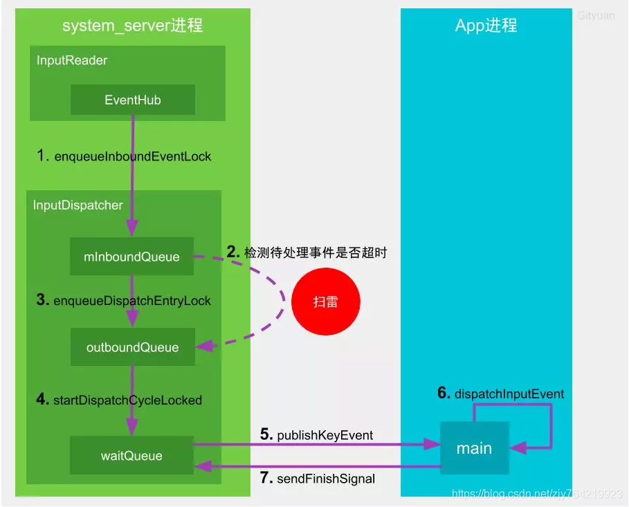
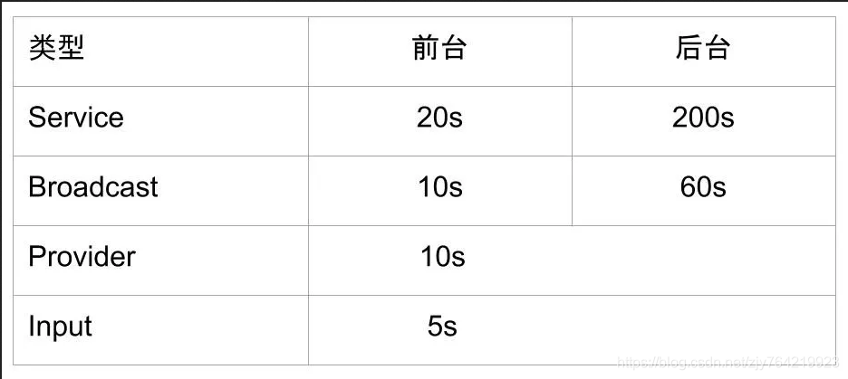

### ANR是什么，怎么解决？ANR查找?

#### 是什么

1. 触摸事件5秒未响应
2. 广播10秒未处理完
3. ServiceTimeout 20秒未处理完
4. 线程死锁

### ANR触发机制

1. 埋定时炸弹：中控系统(system_server进程)启动倒计时，在规定时间内如果目标(应用进程)没有干完所有的活，则中控系统会定向炸毁(杀进程)目标。
2. 拆炸弹：在规定的时间内干完工地的所有活，并及时向中控系统报告完成，请求解除定时炸弹，则幸免于难。
3. 引爆炸弹：中控系统立即封装现场，抓取快照，搜集目标执行慢的罪证(traces)，便于后续的案件侦破(调试分析)，最后是炸毁目标。

### Service超时机制

### BroadCast机制
静态广播

动态广播

### provider超时机制

### input超时机制

### ANR超时阈值

#### 查找

- 开源框架ANR-WatchDog https://github.com/SalomonBrys/ANR-WatchDog
- Trace.txt分析

#### 解决

- 使用子线程处理耗时操作，例如：网络、数据库、I/0
- UI线程只做View的操作
- 使用Handler

参考：
https://www.huaweicloud.com/articles/2423e6871bff3f75b34f097f60a675b5.html
