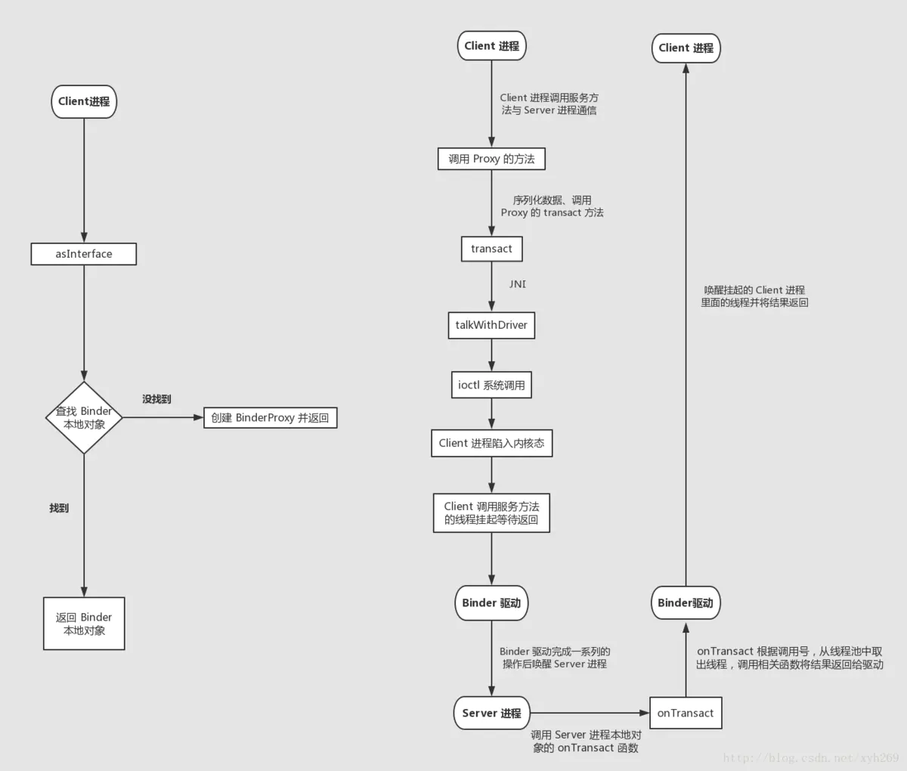
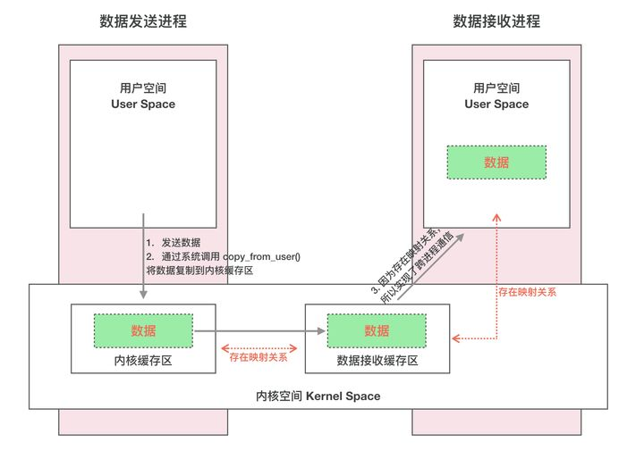
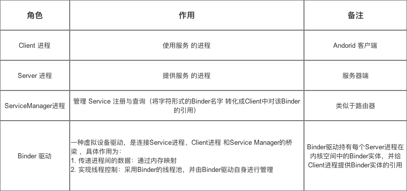
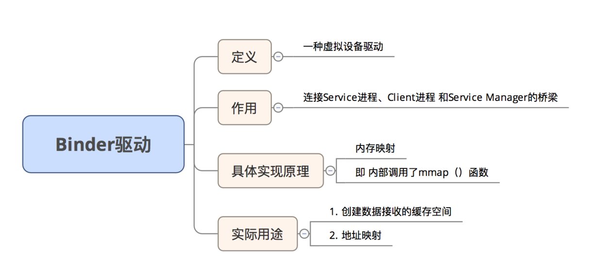
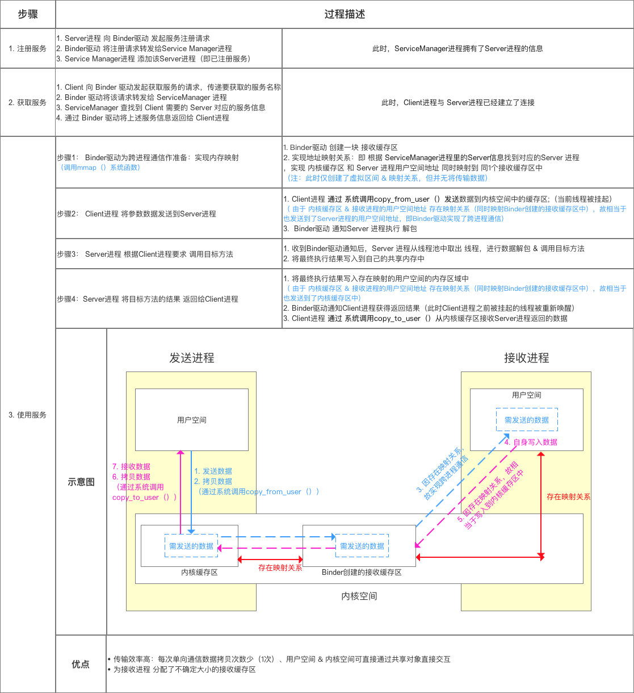
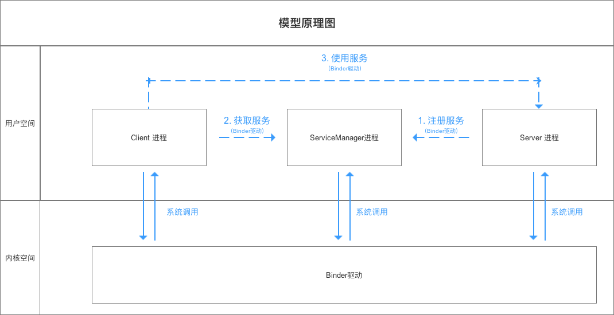
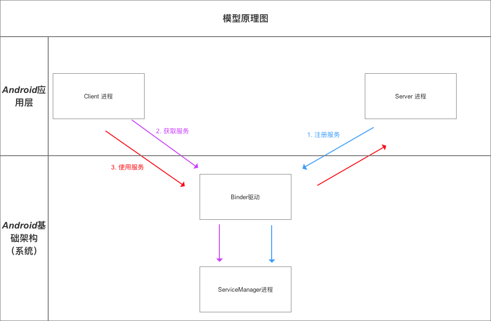
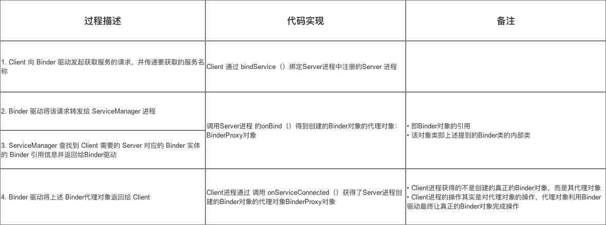
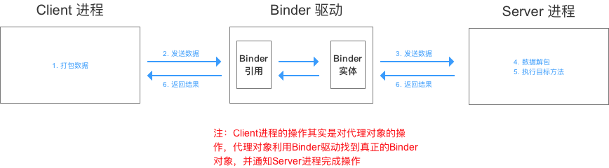
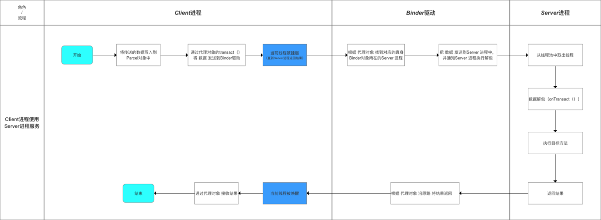

### 描述下Binder机制原理？

#### 系统调用：用户态与内核态
- 当一个任务（进程）执行系统调用而陷入内核代码中执行时，称进程处于内核运行态（内核态）。
- 当进程在执行用户自己的代码的时候，我们称其处于用户运行态（用户态）

#### Binder 跨进程通信原理

但是 Binder 并不是 Linux 系统内核的一部分，那怎么办呢？这就得益于 Linux 的`动态内核可加载模块`（Loadable Kernel Module，LKM）的机制；
模块是具有独立功能的程序，它可以被单独编译，但是不能独立运行。它在运行时被链接到内核作为内核的一部分运行。这样，Android 系统就可以通过动态添加一个内核模块运行在内核空间，
用户进程之间通过这个内核模块作为桥梁来实现通信

#### 内存映射
Binder IPC 机制中涉及到的内存映射通过 mmap() 来实现，mmap() 是操作系统中一种内存映射的方法。内存映射简单的讲就是将用户空间的一块内存区域映射到内核空间。
映射关系建立后，用户对这块内存区域的修改可以直接反应到内核空间；反之内核空间对这段区域的修改也能直接反应到用户空间。

#### Binder IPC 实现原理
一次完整的 Binder IPC 通信过程通常是这样：
1. 首先 Binder 驱动在内核空间创建一个数据接收缓存区；
2. 接着在内核空间开辟一块内核缓存区，建立`内核缓存区`和`内核中数据接收缓存区`之间的映射关系，以及`内核中数据接收缓存区`和`接收进程用户空间地址`的映射关系；
3. 发送方进程通过系统调用 copyfromuser() 将数据 copy 到内核中的`内核缓存区`，由于内核缓存区和接收进程的用户空间存在内存映射，
因此也就相当于把数据发送到了接收进程的用户空间，这样便完成了一次进程间的通信。

#### Binder 跨进程通信机制 模型

模型原理步骤说明

1. Client进程、Server进程 & Service Manager进程属于进程空间的用户空间，不可进行进程间交互
2. Binder驱动 属于 进程空间的 内核空间，可进行进程间 & 进程内交互

Binder驱动 & Service Manager进程 属于 Android基础架构（即系统已经实现好了）；而Client 进程 和 Server 进程 属于Android应用层（需要开发者自己实现）
 

Binder请求的线程管理
- Server进程会创建很多线程来处理Binder请求
- Binder模型的线程管理 采用Binder驱动的线程池，并由Binder驱动自身进行管理

 

 

 

参考
- https://zhuanlan.zhihu.com/p/35519585
- https://blog.csdn.net/carson_ho/article/details/73560642
