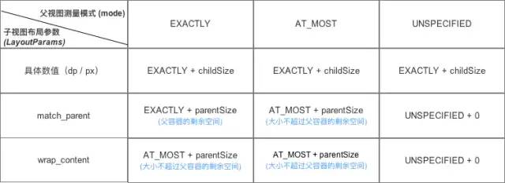

### 说说你理解的MeasureSpec

MeasureSpec是由父View的MeasureSpec和子View的LayoutParams通过简单的计算得出一个针对子View的测量要求，这个测量要求就是MeasureSpec。

首先，MeasureSpec是一个大小跟模式的组合值,MeasureSpec中的值是一个整型（32位）将size和mode打包成一个Int型，其中高两位是mode，后面30位存的是size

~~~java
  // 获取测量模式
  int specMode = MeasureSpec.getMode(measureSpec)
 
  // 获取测量大小
  int specSize = MeasureSpec.getSize(measureSpec)
 
  // 通过Mode 和 Size 生成新的SpecMode
  int measureSpec=MeasureSpec.makeMeasureSpec(size, mode);
~~~

其次，每个子View的MeasureSpec值根据子View的布局参数和父容器的MeasureSpec值计算得来的，所以就有一个父布局测量模式，子视图布局参数，以及子view本身的MeasureSpec关系图：

其实也就是getChildMeasureSpec方法的源码逻辑，会根据子View的布局参数和父容器的MeasureSpec计算出来单个子view的MeasureSpec。

最后是实际应用时：

对于自定义的单一view，一般可以不处理onMeasure方法，如果要对宽高进行自定义，就重写onMeasure方法，并将算好的宽高通过setMeasuredDimension方法传进去。对于自定义的ViewGroup，
一般需要重写onMeasure方法，并且调用measureChildren方法遍历所有子View并进行测量（measureChild方法是测量具体某一个view的宽高），
然后可以通过getMeasuredWidth/getMeasuredHeight获取宽高，最后通过setMeasuredDimension方法存储本身的总宽高。

