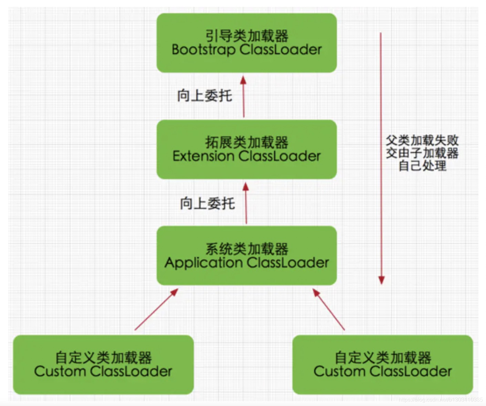

### ClassLoader的双亲委派机制

某个特定的类加载器在接到加载类的请求时，首先将加载任务委托给父类加载器，依次递归，如果父类加载器可以完成类加载任务，就成功返回；**只有父类加载器无法完成此加载任务时，才自己去加载。**

双亲委派模型有两个好处：

1. 向上委托给父类加载，父类加载不了再自己加载
2. 避免重复加载，防止Java核心api被篡改

个人理解：

- java虚拟机中的class其实都是通过classloader来装载的
- 只有当你使用该class的时候才会去装载，一个classloader只会装载同一个class一次。
- 不同的类加载器的实例所加载的字节码文件，其通过反射获取的对象不是相同类型（相互赋值会抛出类型强转异常）。即：判断两个类是否为同一对象的标准里面有一条是类加载器必须为相同。
- 双亲委派机制能在很大程度上防止内存中出现多个相同的字节码文件。
- 在加载类的时候默认会使用当前类的ClassLoader进行加载（类A中引用了类B，JVM会用类A的类加载器加载类B）。
- 在线程中加载一个类的时候：当前线程的类加载器可以通过Thread类的getContextClassLoader()获得，也可以通过setContextClassLoader()自己设置类加载器（PS：自己没有试验过）。

