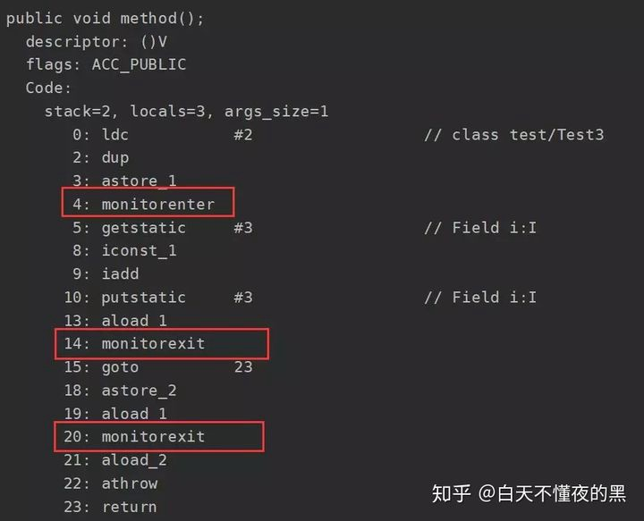
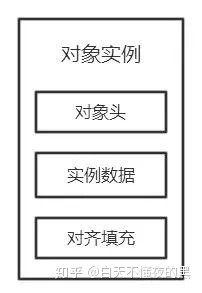

### 一、synchronized的特性

1.原子性   
2.可见性   
3.有序性   

禁止指令重排。例如下面writer方法中的flag和a没有数据依赖关系，因此可以指令重排，但却会在多线程的情况下，影响结果。

~~~java
class ReorderExample {
  int a = 0;
  boolean flag = false;

  public void writer() {
  a = 1; //1
  flag = true; //2
  }

  public void reader() {
  if (flag) { //3
    int i = a * a; //4
    ……
     }
  }
}
~~~

4.可重入性    
一个线程拥有了锁仍然还可以重复申请锁

二、synchronized的用法

synchronized可以修饰静态方法、成员函数，同时还可以直接定义代码块，
但是归根结底它上锁的资源只有两类：一个是对象，一个是类。

三、synchronized锁的实现

在进入该方法之前先获取相应的锁，锁的计数器+1，方法结束后计数器-1，如果获取失败就阻塞住，知道该锁被释放。

但是为什么会有两个monitorexit呢？其实第二个monitorexit是来处理异常的，仔细看反编译的字节码，正常情况下第一个monitorexit之后会执行goto指令，
而该指令转向的就是23行的return，也就是说正常情况下只会执行第一个monitorexit释放锁，然后返回。而如果在执行中发生了异常，
第二个monitorexit就起作用了，它是由编译器自动生成的，在发生异常时处理异常然后释放掉锁。

四、synchronized锁的底层实现

在理解锁实现原理之前先了解一下Java的对象头和Monitor，在JVM中，对象是分成三部分存在的：对象头、实例数据、对其填充。

对象头是我们需要关注的重点，它是synchronized实现锁的基础，因为synchronized申请锁、上锁、释放锁都与对象头有关。
对象头主要结构是由Mark Word 和 Class Metadata Address组成，其中Mark Word存储对象的hashCode、锁信息或分代年龄或GC标志等信息，
Class Metadata Address是类型指针指向对象的类元数据，JVM通过该指针确定该对象是哪个类的实例。

总共就是四个状态：无锁状态、偏向锁、轻量级锁、重量级锁

~~~
ObjectMonitor() {
    _header       = NULL;
    _count        = 0;  //锁计数器
    _waiters      = 0,
    _recursions   = 0;
    _object       = NULL;
    _owner        = NULL;
    _WaitSet      = NULL; //处于wait状态的线程，会被加入到_WaitSet
    _WaitSetLock  = 0 ;
    _Responsible  = NULL ;
    _succ         = NULL ;
    _cxq          = NULL ;
    FreeNext      = NULL ;
    _EntryList    = NULL ; //处于等待锁block状态的线程，会被加入到该列表
    _SpinFreq     = 0 ;
    _SpinClock    = 0 ;
    OwnerIsThread = 0 ;
  }
~~~

ObjectMonitor中有两个队列_WaitSet和_EntryList，用来保存ObjectWaiter对象列表(每个等待锁的线程都会被封装ObjectWaiter对象)
，_owner指向持有ObjectMonitor对象的线程，当多个线程同时访问一段同步代码时，首先会进入_EntryList 集合，
当线程获取到对象的monitor 后进入 _Owner 区域并把monitor中的owner变量设置为当前线程同时monitor中的计数器count加1，
若线程调用 wait() 方法，将释放当前持有的monitor，owner变量恢复为null，count自减1，同时该线程进入 WaitSe t集合中等待被唤醒。
若当前线程执行完毕也将释放monitor(锁)并复位变量的值，以便其他线程进入获取monitor(锁)。
monitor对象存在于每个Java对象的对象头中(存储的指针的指向)，synchronized锁便是通过这种方式获取锁的，也是为什么Java中任意对象可以作为锁的原因，
同时也是notify/notifyAll/wait等方法存在于顶级对象Object中的原因(关于这点稍后还会进行分析)
