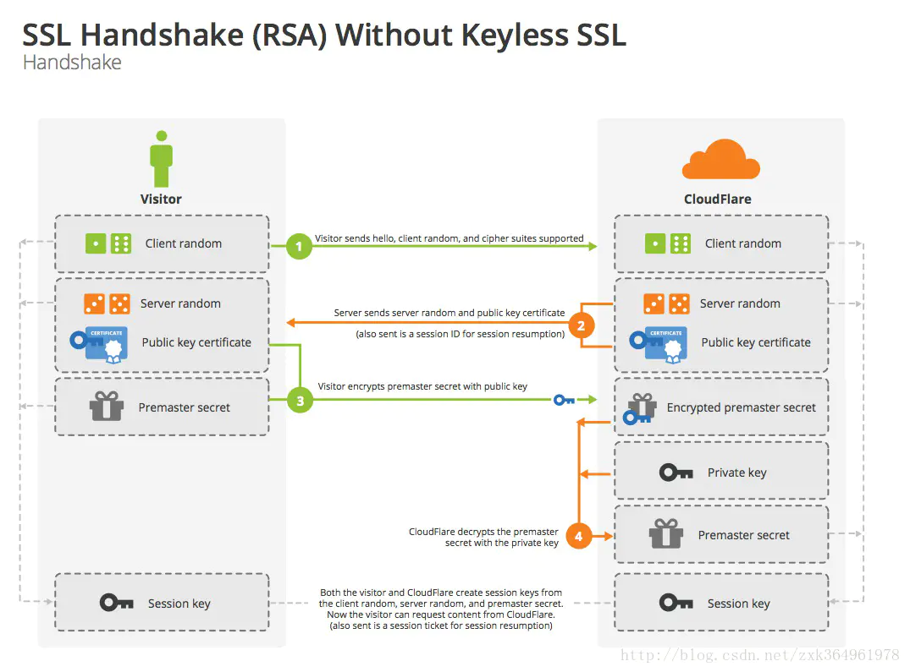

### SSL四次握手过程

1. 客户端请求建立SSL链接，并向服务端发送一个随机数–Client random和客户端支持的加密方法，比如RSA公钥加密，此时是明文传输。
2. 服务端回复一种客户端支持的加密方法、一个随机数–Server random、授信的服务器证书和非对称加密的公钥。
3. 客户端收到服务端的回复后利用服务端的公钥，加上新的随机数–Premaster secret 通过服务端下发的公钥及加密方法进行加密，发送给服务器。
4. 服务端收到客户端的回复，利用已知的加解密方式进行解密，同时利用Client random、Server random和Premaster secret通过一定的算法生成HTTP链接数据传输的对称加密key – session key
