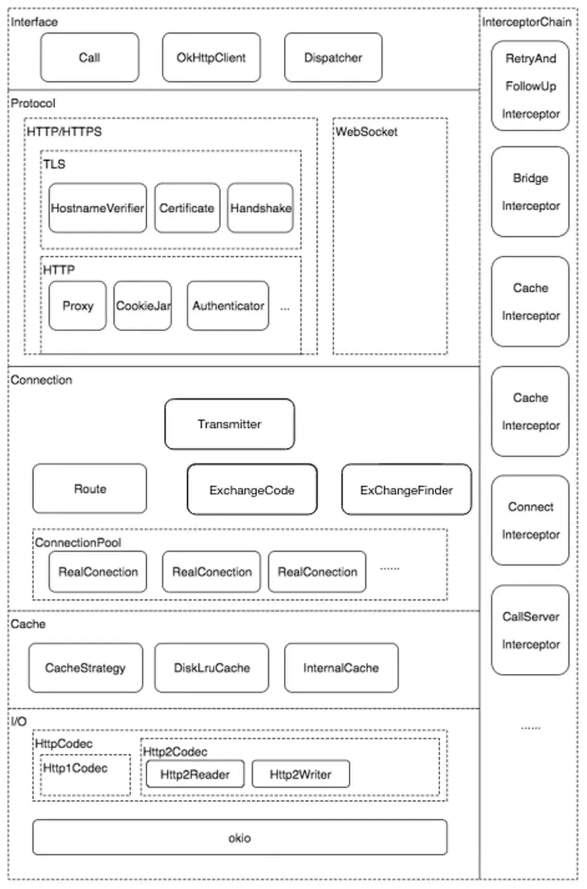

#### 拦截器：

- BridgeInterceptor   
1.负责把用户构造的请求转换为发送到服务器的请求 、把服务器返回的响应转换为用户友好的响应，是从应用程序代码到网络代码的桥梁      
2.设置内容长度，内容编码     
3.设置gzip压缩，并在接收到内容后进行解压。省去了应用层处理数据解压的麻烦   
4.添加cookie    
5.设置其他报头，如User-Agent,Host,Keep-alive等。其中Keep-Alive是实现连接复用的必要步骤    

- CacheInterceptor    
通过Request尝试到Cache中拿缓存（里面非常多流程），当然前提是OkHttpClient中配置了缓存，默认是不支持的。

- ConnectInterceptor    
1.尝试当前连接是否可以复用。   
2.尝试连接池中找可以复用的连接    
3.切换路由，继续在连接中尝试找可以复用的连接   
4.以上都没有则new一个新的。    
5.新的连接放入连接池   
6.建立连接,开始握手   

- RetryAndFollowUpInterceptor   
负责失败自动重连和必要的重定向   
1.协议问题，不能重试。    
2.安全问题，不要重试。    
3.如果是超时问题，并且请求没有被发送，可以重试，其他的就不要重试了。   
4.没有更多的可以使用的路由,不能重试   
5.如果我们在配置OkHttpClient中配置retryOnConnectionFailure属性为false，表明拒绝失败重连，那么这里返回false   

- CallServerInterceptor   
1.先写入请求Header   
2.如果请求头的Expect: 100-continue时，只发送请求头，执行3，不然执行4    
3.根据后台返回的结果判断是否继续请求流程   
4.写入请求体，完成请求    
5.得到响应头，构建初步响应    
6.构建响应体，完成最终响应    
7.返回响应    

#### 缓存策略   
 - 强制缓存：直接向缓存数据库请求数据，如果找到了对应的缓存数据，并且是有效的，就直接返回缓存数据。如果没有找到或失效了，
则向服务器请求数据，返回数据和缓存规则，同时将数据和缓存规则保存到缓存数据库中。    

- 对比缓存：是先向缓存数据库获取缓存数据的标识，然后用该标识去服务器请求该标识对应的数据是否失效，如果没有失效，
服务器会返回304未失效响应，则客户端使用该标识对应的缓存。如果失效了，
服务器会返回最新的数据和缓存规则，客户端使用返回的最新数据，同时将数据和缓存规则保存到缓存数据库中。

