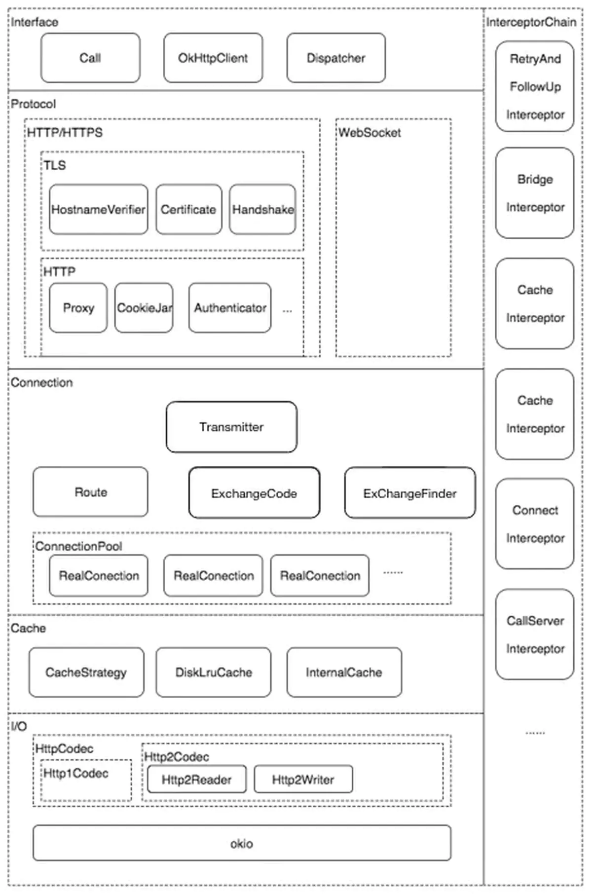

#### 拦截器：

- BridgeInterceptor   
1.负责把用户构造的请求转换为发送到服务器的请求 、把服务器返回的响应转换为用户友好的响应，是从应用程序代码到网络代码的桥梁      
2.设置内容长度，内容编码     
3.设置gzip压缩，并在接收到内容后进行解压。省去了应用层处理数据解压的麻烦   
4.添加cookie    
5.设置其他报头，如User-Agent,Host,Keep-alive等。其中Keep-Alive是实现连接复用的必要步骤    

- CacheInterceptor    
通过Request尝试到Cache中拿缓存（里面非常多流程），当然前提是OkHttpClient中配置了缓存，默认是不支持的。

- ConnectInterceptor    
1.尝试当前连接是否可以复用。   
2.尝试连接池中找可以复用的连接    
3.切换路由，继续在连接中尝试找可以复用的连接   
4.以上都没有则new一个新的。    
5.新的连接放入连接池   
6.建立连接,开始握手   

- RetryAndFollowUpInterceptor   
负责失败自动重连和必要的重定向   
1.协议问题，不能重试。    
2.安全问题，不要重试。    
3.如果是超时问题，并且请求没有被发送，可以重试，其他的就不要重试了。   
4.没有更多的可以使用的路由,不能重试   
5.如果我们在配置OkHttpClient中配置retryOnConnectionFailure属性为false，表明拒绝失败重连，那么这里返回false   

- CallServerInterceptor   
1.先写入请求Header   
2.如果请求头的Expect: 100-continue时，只发送请求头，执行3，不然执行4    
3.根据后台返回的结果判断是否继续请求流程   
4.写入请求体，完成请求    
5.得到响应头，构建初步响应    
6.构建响应体，完成最终响应    
7.返回响应    

#### 缓存策略   
 - 强制缓存：直接向缓存数据库请求数据，如果找到了对应的缓存数据，并且是有效的，就直接返回缓存数据。如果没有找到或失效了，
则向服务器请求数据，返回数据和缓存规则，同时将数据和缓存规则保存到缓存数据库中。    

- 对比缓存：是先向缓存数据库获取缓存数据的标识，然后用该标识去服务器请求该标识对应的数据是否失效，如果没有失效，
服务器会返回304未失效响应，则客户端使用该标识对应的缓存。如果失效了，
服务器会返回最新的数据和缓存规则，客户端使用返回的最新数据，同时将数据和缓存规则保存到缓存数据库中。

#### 问题

一、对于网络请求都有哪些优化
- 通过ConnectionPool来减少请求延时.可以有5个空闲的connection并保持5分钟。**相同IP address公用一个connection**。长链接策略
- 无缝支持GZIP来减少数据流量
- 以从很多常用的连接问题中自动恢复
如果你的服务有多个IP地址，当第一个IP请求失败时，OkHttp会交替尝试你配置的其他IP，OkHttp使用现代TLS技术(SNI, ALPN)初始化新的连接，当握手失败时会回退到TLS 1.0。
- 缓存响应数据来减少重复的网络请求
OKHttp默认只支持get请求的缓存
通过字段 Expires 与 Cache-Control 标识

~~~java
public final class HttpEngine {

  //发送请求
  public void sendRequest() throws RequestException, RouteException, IOException {
    if (cacheStrategy != null) return; // Already sent.
    if (httpStream != null) throw new IllegalStateException();
    //根据用户请求得到实际的网络请求
    Request request = networkRequest(userRequest);
    //这里InternalCache就是对Cache的封装，它的实现在Cache的internalCache中。
    InternalCache responseCache = Internal.instance.internalCache(client);
    //通过Cache的get方法查找缓存响应
    Response cacheCandidate = responseCache != null
        ? responseCache.get(request)
        : null;

    long now = System.currentTimeMillis();
    //构造缓存策略，然后进行策略判断
    cacheStrategy = new CacheStrategy.Factory(now, request, cacheCandidate).get();
    //策略判定后的网络请求和缓存响应
    networkRequest = cacheStrategy.networkRequest;
    cacheResponse = cacheStrategy.cacheResponse;
    
    if (responseCache != null) {
      //使用缓存响应的话，记录一下使用记录
      responseCache.trackResponse(cacheStrategy);
    }

    if (cacheCandidate != null && cacheResponse == null) {
      //使用网络请求，但是之前又有缓存的话，要关闭缓存，释放资源
      closeQuietly(cacheCandidate.body()); // The cache candidate wasn't applicable. Close it.
    }

    // If we're forbidden from using the network and the cache is insufficient, fail.
    if (networkRequest == null && cacheResponse == null) {
      //强制使用缓存，又找不到缓存，就报不合理请求响应了
      userResponse = new Response.Builder()
          .request(userRequest)
          .priorResponse(stripBody(priorResponse))
          .protocol(Protocol.HTTP_1_1)
          .code(504)
          .message("Unsatisfiable Request (only-if-cached)")
          .body(EMPTY_BODY)
          .build();
      return;
    }
    
    //上面情况处理之后，就是使用缓存返回，还是网络请求的情况了

    // If we don't need the network, we're done.
    if (networkRequest == null) {
      //使用缓存返回响应
      userResponse = cacheResponse.newBuilder()
          .request(userRequest)
          .priorResponse(stripBody(priorResponse))
          .cacheResponse(stripBody(cacheResponse))
          .build();
      userResponse = unzip(userResponse);
      return;
    }

    //使用网络请求
    //下面就是网络请求流程了，略
    ...
  }  
}
~~~

一、对于网络请求都有哪些优化

